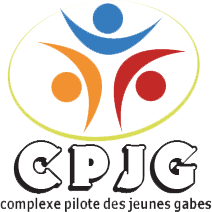

# Complexe Jeunes Gabès

<p align="center">
  
</p>

<p align="center">
  <strong>Digital platform for Complexe Jeunes Gabès</strong>
</p>

<p align="center">
  A web platform designed to showcase youth activities, clubs, events and projects.
</p>

<p align="center">
  
  
  
  
</p>

---

## ✦ Overview

**Complexe Jeunes Gabès** is a web platform developed during my web development internship at **Complexe Jeunes Gabès, Tunisia**.

The project aims to provide a modern digital presence for the youth center and make its activities, clubs, events and projects easier to discover and manage.

The platform includes a public-facing website and an administrative interface.

---

## 🎯 Objectives

The main objectives of the project are:

- Digitize the presentation of Complexe Jeunes Gabès.
- Centralize information about clubs and activities.
- Make events and youth programs easier to discover.
- Provide an interface for administrative management.
- Improve the digital experience for young people.
- Explore the use of AI to enhance the platform and assist users.

---

## ✨ Features

### 🌐 Public Platform

- Presentation of Complexe Jeunes Gabès
- Clubs and activities showcase
- Events and projects presentation
- Responsive user interface
- Custom visual identity

### 🔐 Administration

- Dedicated administration interface
- Content management
- Platform administration features

### 📧 Additional Functionality

- Email verification workflow
- Deployment configuration
- Structured frontend architecture

---

## 🖥️ Interface

### Home Page


### Administration Dashboard

> Screenshot coming soon

<!-- Add your screenshot here:

-->

---

## 🛠️ Tech Stack

| Technology | Purpose |
|------------|---------|
| HTML5 | Structure |
| CSS3 | Styling & responsive design |
| JavaScript | Interactivity & logic |
| Git | Version control |
| GitHub | Source code management |
| Vercel | Deployment |

---

## 📁 Project Structure

```text
complexe-jeunes-gabes-plateform/
│
├── index.html
├── admin.html
├── verify-email.js
├── logo.png
├── vercel.json
└── README.md
